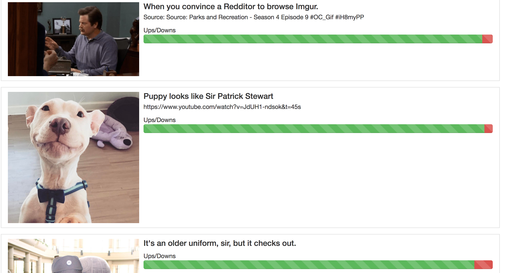

# Sample Meteor React App - Images

A very basic application build with meteor and react that performs an API request to imgur
and shows a list of images with their details.

## To Run
1. clone
2. `cd` and run `npm install`
3. `meteor`

## Notable
* Bootstrapping Meteor app
* Basics of React

